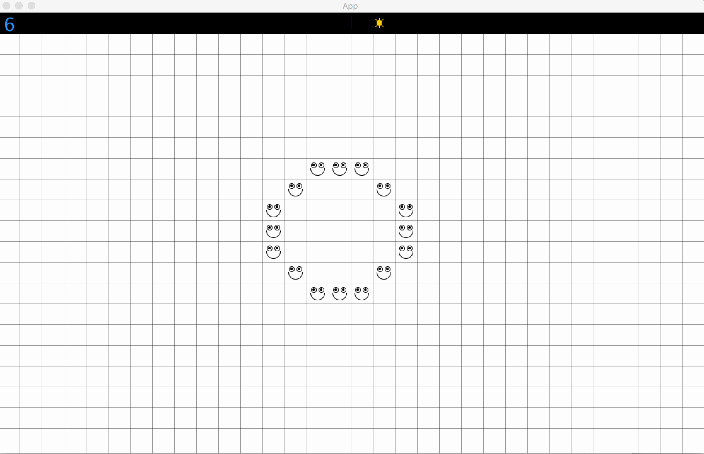

# Game of Life by Giorgio Gross

  

This is a demonstration application for Convey's Game of Life. One cycle ("day") takes 8 seconds (4 seconds night,
4 seconds day). Day cycle frequency can be decreased or increased by pressing '-' or '+'.
On midnight the rules of the game of life are executed and some cells die and some cells are revived.
As the user can manually revive cells (by clicking on them) this implementations offers a somehow playful character.
In contrast to several other implementations I chose not to offer functions like adjusting the grid size but instead
show off an understandable and neat presentation of the game of life.

#### How To Run
I added the .jar file to this git repo so that you can launch it easily. However, to work with the code in an IDE head
over to [Processing.org](https://www.processing.org), download the newest version of Processing and add the core.jar as
library to your IDE project (located in ~/Processing/Contents/Java/core.jar).

Code Structure
==
Views all extend the View class and are responsible for rendering their corresponding element on the canvas.
Elements implement required logic for the view and maintain their state (like the environment does) or obtain it from a
central state provider (like the CellStateManager for the cells). Unrelated elements can notify each other through
event providers. That way cells can observe the environment (and wake up in the morning / fall asleep in the evening)
and the environment can observe settings changes. As the app class acts like a central component to which user inputs
arrive first it also delegates click events to all interested views.

Instantiation and localization of each component (cell, environment) happens in the app class too, as it is the main
entry point. Here elements are bound to their views, observers are hooked up and finally the render loop is handled and
delegated to the elements. Still, there is little to none logic in the app class as that's the business of the elements.

The rules of the game of life are implemented in the CellStateManager. That way states of other cells can easily be
accessed without the need to interconnect each cell with its neighbours.

### Key Features
 * Delegation for events and rendering; each element cares for these jobs in its own
 * Machine (fps) independent rendering relying on raw time passed
 * Self-contained cells presenting themselves to the user while encapsulating game of life logic in a central state manager
 * Changing an element's behaviour/style or adding new behaviours/style does not affect any other classes
 * Adding elements is as easy as subclassing element and view classes and hooking them up in the app class
 * Scalable to several hundreds of cells (...though there are better approaches to simulate several thousands of cells.
 The bottleneck of this implementation is the heavy use of delegation in the UI thread, but as it reduces complexity and
 perfectly fits the chosen cell grid's scale I decided not to use a multithreading approach)
 * Neat UI (from my point of view.. ;) )
